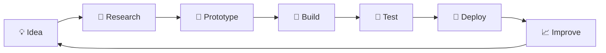

<!-- =========================================================
     KRITYAM SINGH — GITHUB PROFILE README
     AI × CYBERPUNK × KALI LINUX
========================================================= -->

<div align="center">


<br/>

<a href="mailto:krityamsingh100@gmail.com">
  
</a>
<a href="https://t.me/Unrealrajput">
  
</a>
<a href="https://github.com/krityamsingh?tab=followers">
  
</a>


<br/><br/>


</div>

---

## `> whoami`


```python
class KrityamSingh:
    def __init__(self):
        self.name = "Krityam Singh"
        self.role = "AI Developer & Student"
        self.location = "Varanasi, India 🇮🇳"
        self.os = "Kali Linux 🐉"

        self.stack = [
            "Python",
            "TensorFlow",
            "Keras",
            "NumPy",
            "Pandas",
            "Scikit-Learn",
        ]

        self.exploring = [
            "Deep Learning",
            "Computer Vision",
            "JavaScript",
            "AI Deployment",
        ]

        self.current_mission = (
            "Turn AI concepts into useful, working systems."
        )

    def mindset(self):
        return "Learn → Build → Break → Debug → Improve → Repeat ⚡"


me = KrityamSingh()
print(me.mindset())
```

<br clear="right"/>

---

## 🧬 About Me

```text
┌──────────────────────────────────────────────────────────┐
│  NAME       : Krityam Singh                              │
│  ROLE       : AI Developer & Student                     │
│  LOCATION   : Varanasi, India 🇮🇳                         │
│  OS         : Kali Linux 🐉                               │
│  FOCUS      : Artificial Intelligence                    │
│  EXPLORING  : Deep Learning + Computer Vision            │
│  BUILDING   : AI experiments, tools and systems          │
│  MISSION    : Convert ideas into intelligent software    │
└──────────────────────────────────────────────────────────┘
```

- 🧠 Focused on **Artificial Intelligence & Machine Learning**
- 🐍 Building primarily with **Python**
- 🔬 Exploring **Deep Learning** and **Computer Vision**
- 📊 Working with **NumPy, Pandas, TensorFlow, Keras and Scikit-Learn**
- 🌐 Learning how to bring AI systems to the **web**
- 🐉 Daily-driving **Kali Linux**
- ⚙️ Learning by building real projects instead of only reading theory
- 🚀 Goal: build and deploy intelligent systems that solve useful problems

---

## 🎯 Current Mission

<div align="center">

| Mission | State |
| :--- | :---: |
| 🧠 Strengthen Deep Learning fundamentals | `IN PROGRESS` |
| 👁️ Build Computer Vision projects | `EXPLORING` |
| 🌐 Improve JavaScript & web skills | `LEARNING` |
| 🚀 Deploy AI applications | `NEXT TARGET` |
| 🛠️ Build useful public AI tools | `BUILDING` |

</div>

---

## ⚡ Technology Arsenal

<div align="center">

### 🧠 AI / Machine Learning


<br/>


### 🌐 Web


### ⚙️ Tools & Environment


<br/>


</div>

---

## 🧠 Skill Matrix

```text
Python                 ██████████████████░░   Main Language
NumPy / Pandas         ████████████████░░░░   Active Use
Machine Learning       ██████████████░░░░░░   Building
TensorFlow / Keras     ████████████░░░░░░░░   Growing
Deep Learning          ██████████░░░░░░░░░░   Learning
Computer Vision        ███████░░░░░░░░░░░░░   Exploring
JavaScript             █████░░░░░░░░░░░░░░░   Learning
AI Deployment          ███░░░░░░░░░░░░░░░░░   Next Focus
```

> **The goal is not to collect technologies. The goal is to understand them well enough to build something useful.**

---

## ⚙️ How I Build



---

## 🚀 Project Laboratory

<div align="center">

### `BUILD → TEST → SHIP → IMPROVE`

</div>

I use GitHub as my engineering laboratory — experimenting with AI, automation, machine learning and software ideas instead of keeping everything inside notebooks.

| Area | What I'm Exploring |
| :--- | :--- |
| 🤖 **Artificial Intelligence** | Intelligent applications and AI-powered tools |
| 🧠 **Deep Learning** | Neural networks and model experimentation |
| 👁️ **Computer Vision** | Image understanding and vision-based systems |
| 📊 **Data** | NumPy, Pandas, preprocessing and experimentation |
| 🌐 **AI + Web** | Turning models into usable web applications |
| ⚙️ **Developer Tools** | Automation and productivity projects |
| 🐉 **Linux** | Kali Linux workflows and development |

<div align="center">

<a href="https://github.com/krityamsingh?tab=repositories">
  
</a>

</div>

---

## 🧪 Engineering Philosophy

<div align="center">

```text
                         ┌───────────┐
                         │   IDEA    │
                         └─────┬─────┘
                               ↓
                     ┌─────────────────┐
                     │    PROTOTYPE    │
                     └────────┬────────┘
                              ↓
              ┌────────────────────────────┐
              │    BUILD SOMETHING REAL    │
              └──────────────┬─────────────┘
                             ↓
                       ┌──────────┐
                       │   FAIL   │
                       └────┬─────┘
                            ↓
                       ┌──────────┐
                       │  LEARN   │
                       └────┬─────┘
                            ↓
                       ┌──────────┐
                       │ IMPROVE  │
                       └────┬─────┘
                            │
                            └──────────────↺
```

### `The fastest way to understand technology is to build with it.`

</div>

---

## 📊 GitHub Intelligence

<div align="center">


<br/>


</div>

---

## 📈 Contribution Activity

<div align="center">


</div>

---

## 🏆 GitHub Achievements

<div align="center">


</div>

---

## 🗺️ AI Engineer Roadmap

```text
                         KRITYAM'S AI ROADMAP

       Python
         │
         ▼
 NumPy + Pandas
         │
         ▼
Machine Learning
         │
         ▼
 TensorFlow / Keras
         │
         ▼
   Deep Learning
         │
         ├───────────────┐
         ▼               ▼
 Computer Vision       NLP / LLMs
         │               │
         └───────┬───────┘
                 ▼
          AI Applications
                 │
                 ▼
        APIs + Web Deployment
                 │
                 ▼
         Production AI Systems
```

---

## 💻 Developer Console

```bash
$ whoami
krityam

$ cat focus.txt
Artificial Intelligence
Deep Learning
Computer Vision
Open Source
AI Engineering

$ cat mindset.txt
Learn.
Build.
Break.
Debug.
Improve.
Repeat.

$ ./future.sh
Building something intelligent... 🤖
```

---

## 💭 Developer Thought

<div align="center">


</div>

---

## 🤝 Let's Connect

<div align="center">

### Interested in AI, engineering or building cool things?

<br/>

<a href="mailto:krityamsingh100@gmail.com">
  
</a>
<a href="https://t.me/Unrealrajput">
  
</a>
<a href="https://github.com/krityamsingh">
  
</a>

<br/><br/>

### ⚡ `Learning today. Building tomorrow. Shipping continuously.`

</div>


